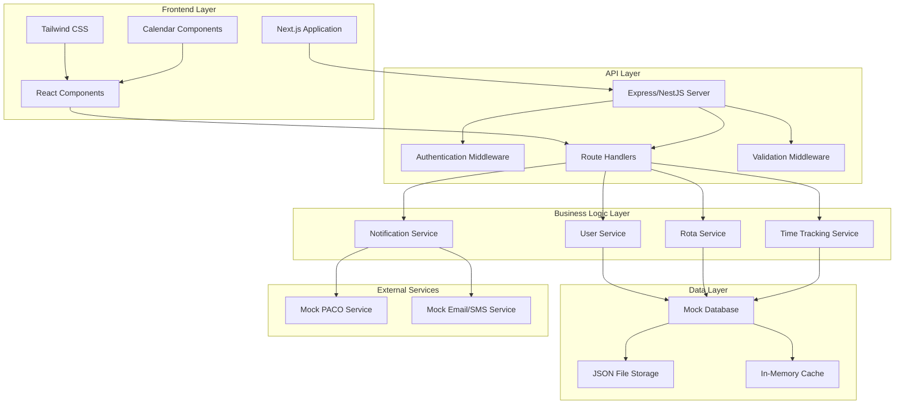
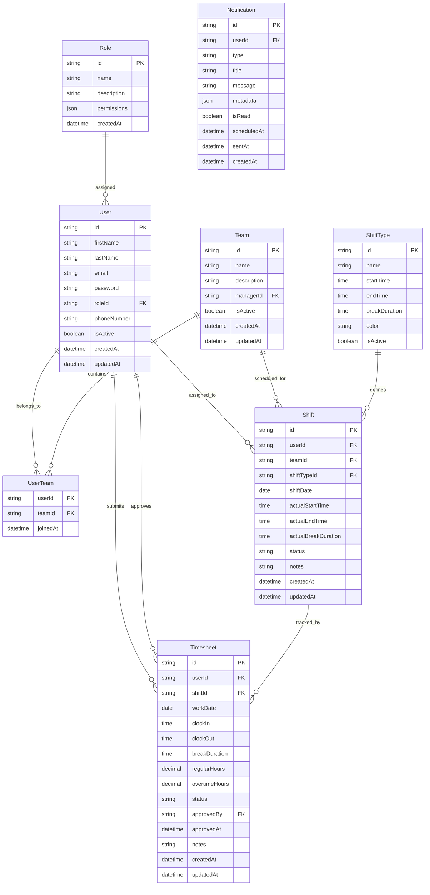
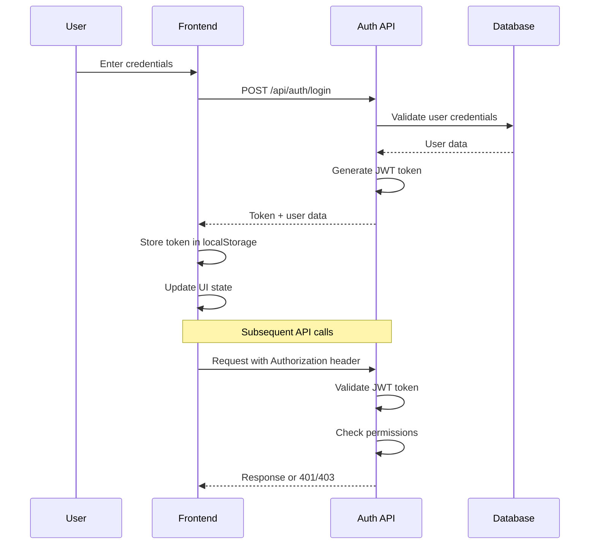
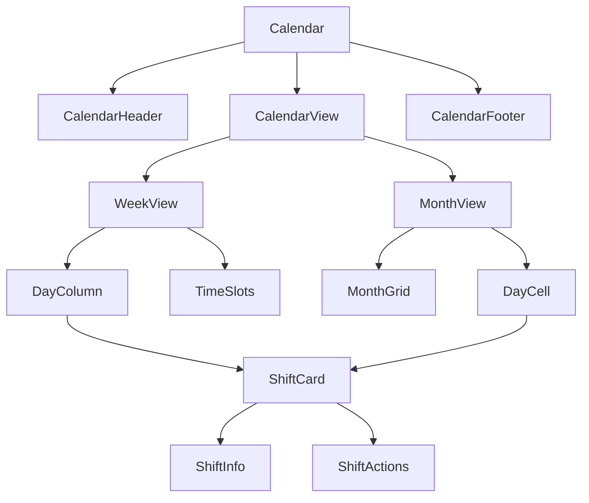

# Rota Management System MVP - Technical Architecture Specification

## Table of Contents
1. [System Overview](#system-overview)
2. [System Architecture](#system-architecture)
3. [Database Schema Design](#database-schema-design)
4. [API Endpoint Specifications](#api-endpoint-specifications)
5. [Authentication and Authorization](#authentication-and-authorization)
6. [Frontend Component Structure](#frontend-component-structure)
7. [Technology Stack Justification](#technology-stack-justification)
8. [Error Handling and Validation](#error-handling-and-validation)
9. [Implementation Approach](#implementation-approach)

---

## System Overview

### Project Description
The Rota Management System is a staff scheduling and time tracking platform designed for small to medium businesses (up to 50 users initially). The system provides comprehensive workforce management capabilities including user management, shift scheduling, time tracking, and notifications.

### Key Requirements
- **User Scale**: Support up to 50 users initially
- **Shift Types**: Standard shift types (Morning, Evening, Night) with predefined durations
- **Calendar Views**: Both weekly and monthly calendar views
- **Time Tracking**: Include break times and basic overtime calculations
- **Notifications**: Shift reminders and schedule change notifications

### Core Features
1. **User Management**: Staff CRUD operations, team assignment, role-based access control
2. **Rota Management**: Calendar-based scheduling, shift assignment, conflict detection
3. **Time Tracking**: Timesheet submission, approval workflow, status tracking
4. **Notification System**: Mock PACO integration, email/SMS simulation

---

## System Architecture

### High-Level Architecture



### Component Responsibilities

#### Frontend Layer
- **Next.js Application**: Provides server-side rendering and routing
- **React Components**: Reusable UI components for forms, tables, and interactive elements
- **Tailwind CSS**: Utility-first CSS framework for responsive design
- **Calendar Components**: Custom calendar views for weekly and monthly scheduling

#### API Layer
- **Express/NestJS Server**: RESTful API server with middleware support
- **Authentication Middleware**: JWT token validation and role-based access control
- **Route Handlers**: HTTP request/response processing
- **Validation Middleware**: Input validation and sanitization

#### Business Logic Layer
- **User Service**: User CRUD operations, team management, role assignments
- **Rota Service**: Shift scheduling, conflict detection, calendar management
- **Time Tracking Service**: Timesheet management, approval workflows, overtime calculations
- **Notification Service**: Alert management, external service integration

#### Data Layer
- **Mock Database**: In-memory data storage for development and testing
- **JSON File Storage**: Persistent data storage using JSON files
- **In-Memory Cache**: Performance optimization for frequently accessed data

---

## Database Schema Design

### Entity Relationship Diagram



### Data Models

#### User Model
```typescript
interface User {
  id: string;
  firstName: string;
  lastName: string;
  email: string;
  password: string; // hashed
  roleId: string;
  phoneNumber?: string;
  isActive: boolean;
  createdAt: Date;
  updatedAt: Date;
}
```

#### Team Model
```typescript
interface Team {
  id: string;
  name: string;
  description?: string;
  managerId: string;
  isActive: boolean;
  createdAt: Date;
  updatedAt: Date;
}
```

#### Shift Model
```typescript
interface Shift {
  id: string;
  userId: string;
  teamId: string;
  shiftTypeId: string;
  shiftDate: Date;
  actualStartTime?: Date;
  actualEndTime?: Date;
  actualBreakDuration?: number; // in minutes
  status: 'scheduled' | 'in_progress' | 'completed' | 'missed';
  notes?: string;
  createdAt: Date;
  updatedAt: Date;
}
```

#### Timesheet Model
```typescript
interface Timesheet {
  id: string;
  userId: string;
  shiftId: string;
  workDate: Date;
  clockIn?: Date;
  clockOut?: Date;
  breakDuration: number; // in minutes
  regularHours: number;
  overtimeHours: number;
  status: 'pending' | 'submitted' | 'approved' | 'rejected';
  approvedBy?: string;
  approvedAt?: Date;
  notes?: string;
  createdAt: Date;
  updatedAt: Date;
}
```

---

## API Endpoint Specifications

### Authentication Endpoints

#### POST /api/auth/login
**Description**: Authenticate user and return JWT token

**Request Body**:
```json
{
  "email": "user@example.com",
  "password": "password123"
}
```

**Response**:
```json
{
  "success": true,
  "data": {
    "token": "eyJhbGciOiJIUzI1NiIsInR5cCI6IkpXVCJ9...",
    "user": {
      "id": "user_id",
      "firstName": "John",
      "lastName": "Doe",
      "email": "user@example.com",
      "role": {
        "name": "Staff",
        "permissions": ["view_own_schedule", "submit_timesheet"]
      }
    }
  }
}
```

#### POST /api/auth/logout
**Description**: Logout user and invalidate token

**Headers**: `Authorization: Bearer <token>`

**Response**:
```json
{
  "success": true,
  "message": "Logged out successfully"
}
```

### User Management Endpoints

#### GET /api/users
**Description**: Get all users (Admin/Manager only)

**Headers**: `Authorization: Bearer <token>`

**Query Parameters**:
- `page`: number (default: 1)
- `limit`: number (default: 10)
- `teamId`: string (optional)
- `isActive`: boolean (optional)

**Response**:
```json
{
  "success": true,
  "data": {
    "users": [
      {
        "id": "user_id",
        "firstName": "John",
        "lastName": "Doe",
        "email": "user@example.com",
        "role": {
          "name": "Staff"
        },
        "teams": [
          {
            "id": "team_id",
            "name": "Frontend Team"
          }
        ],
        "isActive": true
      }
    ],
    "pagination": {
      "page": 1,
      "limit": 10,
      "total": 25,
      "totalPages": 3
    }
  }
}
```

#### POST /api/users
**Description**: Create new user (Admin only)

**Headers**: `Authorization: Bearer <token>`

**Request Body**:
```json
{
  "firstName": "Jane",
  "lastName": "Smith",
  "email": "jane@example.com",
  "password": "password123",
  "roleId": "staff_role_id",
  "phoneNumber": "+1234567890",
  "teamIds": ["team_id_1", "team_id_2"]
}
```

**Response**:
```json
{
  "success": true,
  "data": {
    "id": "new_user_id",
    "firstName": "Jane",
    "lastName": "Smith",
    "email": "jane@example.com",
    "role": {
      "name": "Staff"
    },
    "isActive": true,
    "createdAt": "2023-01-01T00:00:00.000Z"
  }
}
```

#### GET /api/users/:id
**Description**: Get user by ID

**Headers**: `Authorization: Bearer <token>`

**Response**:
```json
{
  "success": true,
  "data": {
    "id": "user_id",
    "firstName": "John",
    "lastName": "Doe",
    "email": "user@example.com",
    "role": {
      "name": "Staff",
      "permissions": ["view_own_schedule", "submit_timesheet"]
    },
    "teams": [
      {
        "id": "team_id",
        "name": "Frontend Team"
      }
    ],
    "isActive": true
  }
}
```

#### PUT /api/users/:id
**Description**: Update user details

**Headers**: `Authorization: Bearer <token>`

**Request Body**:
```json
{
  "firstName": "John",
  "lastName": "Doe",
  "phoneNumber": "+1234567890",
  "teamIds": ["team_id_1"],
  "isActive": true
}
```

**Response**:
```json
{
  "success": true,
  "data": {
    "id": "user_id",
    "firstName": "John",
    "lastName": "Doe",
    "email": "user@example.com",
    "phoneNumber": "+1234567890",
    "updatedAt": "2023-01-01T00:00:00.000Z"
  }
}
```

### Rota Management Endpoints

#### GET /api/shifts
**Description**: Get shifts with filtering options

**Headers**: `Authorization: Bearer <token>`

**Query Parameters**:
- `startDate`: string (ISO date)
- `endDate`: string (ISO date)
- `userId`: string (optional)
- `teamId`: string (optional)
- `status`: string (optional)

**Response**:
```json
{
  "success": true,
  "data": {
    "shifts": [
      {
        "id": "shift_id",
        "userId": "user_id",
        "user": {
          "firstName": "John",
          "lastName": "Doe"
        },
        "teamId": "team_id",
        "team": {
          "name": "Frontend Team"
        },
        "shiftType": {
          "name": "Morning",
          "startTime": "09:00",
          "endTime": "17:00",
          "breakDuration": 60
        },
        "shiftDate": "2023-01-01",
        "status": "scheduled",
        "notes": "Covering for Sarah"
      }
    ]
  }
}
```

#### POST /api/shifts
**Description**: Create new shift

**Headers**: `Authorization: Bearer <token>`

**Request Body**:
```json
{
  "userId": "user_id",
  "teamId": "team_id",
  "shiftTypeId": "morning_shift_id",
  "shiftDate": "2023-01-01",
  "notes": "Regular shift"
}
```

**Response**:
```json
{
  "success": true,
  "data": {
    "id": "new_shift_id",
    "userId": "user_id",
    "teamId": "team_id",
    "shiftTypeId": "morning_shift_id",
    "shiftDate": "2023-01-01",
    "status": "scheduled",
    "createdAt": "2023-01-01T00:00:00.000Z"
  }
}
```

#### GET /api/shift-types
**Description**: Get all shift types

**Headers**: `Authorization: Bearer <token>`

**Response**:
```json
{
  "success": true,
  "data": [
    {
      "id": "morning_shift_id",
      "name": "Morning",
      "startTime": "09:00",
      "endTime": "17:00",
      "breakDuration": 60,
      "color": "#3B82F6",
      "isActive": true
    },
    {
      "id": "evening_shift_id",
      "name": "Evening",
      "startTime": "17:00",
      "endTime": "01:00",
      "breakDuration": 45,
      "color": "#8B5CF6",
      "isActive": true
    },
    {
      "id": "night_shift_id",
      "name": "Night",
      "startTime": "01:00",
      "endTime": "09:00",
      "breakDuration": 45,
      "color": "#1F2937",
      "isActive": true
    }
  ]
}
```

### Time Tracking Endpoints

#### GET /api/timesheets
**Description**: Get timesheets with filtering

**Headers**: `Authorization: Bearer <token>`

**Query Parameters**:
- `startDate`: string (ISO date)
- `endDate`: string (ISO date)
- `userId`: string (optional)
- `status`: string (optional)

**Response**:
```json
{
  "success": true,
  "data": {
    "timesheets": [
      {
        "id": "timesheet_id",
        "userId": "user_id",
        "user": {
          "firstName": "John",
          "lastName": "Doe"
        },
        "shiftId": "shift_id",
        "workDate": "2023-01-01",
        "clockIn": "2023-01-01T09:00:00.000Z",
        "clockOut": "2023-01-01T17:30:00.000Z",
        "breakDuration": 60,
        "regularHours": 8,
        "overtimeHours": 0.5,
        "status": "approved",
        "approvedBy": "manager_id",
        "approvedAt": "2023-01-02T10:00:00.000Z",
        "notes": "Completed tasks ahead of schedule"
      }
    ]
  }
}
```

#### POST /api/timesheets
**Description**: Create or submit timesheet

**Headers**: `Authorization: Bearer <token>`

**Request Body**:
```json
{
  "shiftId": "shift_id",
  "workDate": "2023-01-01",
  "clockIn": "2023-01-01T09:00:00.000Z",
  "clockOut": "2023-01-01T17:30:00.000Z",
  "breakDuration": 60,
  "notes": "Regular workday"
}
```

**Response**:
```json
{
  "success": true,
  "data": {
    "id": "new_timesheet_id",
    "userId": "user_id",
    "shiftId": "shift_id",
    "workDate": "2023-01-01",
    "clockIn": "2023-01-01T09:00:00.000Z",
    "clockOut": "2023-01-01T17:30:00.000Z",
    "breakDuration": 60,
    "regularHours": 8,
    "overtimeHours": 0.5,
    "status": "submitted",
    "createdAt": "2023-01-01T18:00:00.000Z"
  }
}
```

#### PUT /api/timesheets/:id/approve
**Description**: Approve timesheet (Manager/Admin only)

**Headers**: `Authorization: Bearer <token>`

**Request Body**:
```json
{
  "approved": true,
  "notes": "Approved as submitted"
}
```

**Response**:
```json
{
  "success": true,
  "data": {
    "id": "timesheet_id",
    "status": "approved",
    "approvedBy": "manager_id",
    "approvedAt": "2023-01-02T10:00:00.000Z",
    "notes": "Approved as submitted"
  }
}
```

### Notification Endpoints

#### GET /api/notifications
**Description**: Get user notifications

**Headers**: `Authorization: Bearer <token>`

**Query Parameters**:
- `isRead`: boolean (optional)
- `type`: string (optional)

**Response**:
```json
{
  "success": true,
  "data": {
    "notifications": [
      {
        "id": "notification_id",
        "type": "shift_reminder",
        "title": "Shift Reminder",
        "message": "You have a Morning shift tomorrow at 9:00 AM",
        "metadata": {
          "shiftId": "shift_id",
          "shiftDate": "2023-01-02"
        },
        "isRead": false,
        "scheduledAt": "2023-01-01T20:00:00.000Z",
        "sentAt": "2023-01-01T20:00:00.000Z",
        "createdAt": "2023-01-01T18:00:00.000Z"
      }
    ]
  }
}
```

#### PUT /api/notifications/:id/read
**Description**: Mark notification as read

**Headers**: `Authorization: Bearer <token>`

**Response**:
```json
{
  "success": true,
  "data": {
    "id": "notification_id",
    "isRead": true,
    "readAt": "2023-01-01T21:00:00.000Z"
  }
}
```

---

## Authentication and Authorization

### Authentication Flow



### JWT Token Structure

```typescript
interface JWTPayload {
  userId: string;
  email: string;
  role: string;
  permissions: string[];
  iat: number; // issued at
  exp: number; // expiration
}
```

### Role-Based Access Control

#### Role Definitions
1. **Admin**: Full system access
   - User management (CRUD)
   - Team management
   - System configuration
   - All timesheet approvals

2. **Manager**: Team-level access
   - View/manage team users
   - Create and manage team schedules
   - Approve team timesheets
   - View team reports

3. **Staff**: Personal access
   - View own schedule
   - Submit own timesheets
   - View own notifications
   - Update personal profile

#### Permission Matrix

| Feature | Admin | Manager | Staff |
|---------|-------|---------|-------|
| View all users | ✅ | ❌ | ❌ |
| Create users | ✅ | ❌ | ❌ |
| Edit users | ✅ | ❌ | ❌ |
| View team users | ✅ | ✅ | ❌ |
| Create schedules | ✅ | ✅ | ❌ |
| View own schedule | ✅ | ✅ | ✅ |
| Submit timesheet | ✅ | ✅ | ✅ |
| Approve timesheets | ✅ | ✅ | ❌ |
| View reports | ✅ | ✅ | ❌ |

---

## Frontend Component Structure

### Directory Structure

```
src/
├── components/
│   ├── common/
│   │   ├── Button/
│   │   ├── Input/
│   │   ├── Modal/
│   │   ├── Table/
│   │   └── Layout/
│   ├── auth/
│   │   ├── LoginForm/
│   │   └── ProtectedRoute/
│   ├── users/
│   │   ├── UserList/
│   │   ├── UserForm/
│   │   └── UserProfile/
│   ├── rota/
│   │   ├── Calendar/
│   │   ├── ShiftCard/
│   │   ├── ShiftForm/
│   │   └── ConflictDetector/
│   ├── timesheets/
│   │   ├── TimesheetList/
│   │   ├── TimesheetForm/
│   │   └── TimesheetCard/
│   └── notifications/
│       ├── NotificationCenter/
│       └── NotificationItem/
├── pages/
│   ├── api/
│   │   └── [endpoint]/
│   ├── auth/
│   │   └── login.tsx
│   ├── dashboard/
│   │   └── index.tsx
│   ├── users/
│   │   ├── index.tsx
│   │   └── [id].tsx
│   ├── rota/
│   │   ├── index.tsx
│   │   ├── weekly.tsx
│   │   └── monthly.tsx
│   ├── timesheets/
│   │   ├── index.tsx
│   │   └── [id].tsx
│   └── notifications/
│       └── index.tsx
├── hooks/
│   ├── useAuth.ts
│   ├── useApi.ts
│   ├── useNotifications.ts
│   └── useLocalStorage.ts
├── services/
│   ├── api.ts
│   ├── auth.ts
│   ├── users.ts
│   ├── rota.ts
│   ├── timesheets.ts
│   └── notifications.ts
├── utils/
│   ├── date.ts
│   ├── validation.ts
│   ├── permissions.ts
│   └── constants.ts
├── types/
│   ├── user.ts
│   ├── rota.ts
│   ├── timesheet.ts
│   └── notification.ts
└── store/
    ├── auth.ts
    ├── users.ts
    ├── rota.ts
    └── notifications.ts
```

### Component Architecture

#### Calendar Component Structure



#### State Management

```typescript
// Auth Store
interface AuthState {
  user: User | null;
  token: string | null;
  isAuthenticated: boolean;
  permissions: string[];
  login: (credentials: LoginCredentials) => Promise<void>;
  logout: () => void;
  refreshToken: () => Promise<void>;
}

// Rota Store
interface RotaState {
  shifts: Shift[];
  selectedDate: Date;
  viewMode: 'week' | 'month';
  loading: boolean;
  error: string | null;
  fetchShifts: (params: ShiftQueryParams) => Promise<void>;
  createShift: (shift: CreateShiftData) => Promise<void>;
  updateShift: (id: string, shift: UpdateShiftData) => Promise<void>;
  deleteShift: (id: string) => Promise<void>;
}

// Timesheet Store
interface TimesheetState {
  timesheets: Timesheet[];
  loading: boolean;
  error: string | null;
  fetchTimesheets: (params: TimesheetQueryParams) => Promise<void>;
  submitTimesheet: (timesheet: SubmitTimesheetData) => Promise<void>;
  approveTimesheet: (id: string, approved: boolean) => Promise<void>;
}
```

### Routing Structure

```typescript
// pages/index.tsx - Dashboard
// pages/auth/login.tsx - Login
// pages/users/index.tsx - User list
// pages/users/[id].tsx - User details/edit
// pages/rota/index.tsx - Rota (default weekly view)
// pages/rota/weekly.tsx - Weekly rota view
// pages/rota/monthly.tsx - Monthly rota view
// pages/timesheets/index.tsx - Timesheet list
// pages/timesheets/[id].tsx - Timesheet details
// pages/notifications/index.tsx - Notification center
```

---

## Technology Stack Justification

### Backend: NestJS with Express

**Advantages:**
- **TypeScript Support**: Full TypeScript support with decorators and metadata
- **Modular Architecture**: Built-in module system for organized code structure
- **Dependency Injection**: Excellent DI container for testable code
- **Validation**: Built-in validation pipes with class-validator
- **Authentication**: Easy integration with JWT and passport strategies
- **Documentation**: Automatic OpenAPI/Swagger generation
- **Testing**: Built-in testing utilities and Jest integration

**Why NestJS over Express:**
- Better structure for enterprise applications
- Built-in features that would require additional packages in Express
- Excellent TypeScript support out of the box
- Scalable architecture for future growth

### Frontend: Next.js with React

**Advantages:**
- **Server-Side Rendering**: Better SEO and initial page load performance
- **File-Based Routing**: Intuitive routing system
- **API Routes**: Backend and frontend in the same repository
- **Static Generation**: Optimize performance for static pages
- **Image Optimization**: Built-in image optimization
- **TypeScript Support**: Excellent TypeScript integration

**Why Next.js over Create React App:**
- Better performance with SSR/SSG
- Built-in routing and API capabilities
- Optimized for production deployments
- Better developer experience

### Styling: Tailwind CSS

**Advantages:**
- **Utility-First**: Rapid development without writing custom CSS
- **Responsive Design**: Built-in responsive utilities
- **Consistency**: Design system consistency across the application
- **Performance**: Purges unused styles in production
- **Customization**: Easy to customize and extend

### Database: Mock with JSON Files

**Advantages for MVP:**
- **Zero Setup**: No database installation or configuration required
- **Portability**: Easy to backup and migrate data
- **Version Control**: Data can be version controlled
- **Rapid Development**: Focus on features rather than database management
- **Cost**: No hosting costs for database

**Migration Path:**
- Easy to migrate to PostgreSQL, MongoDB, or other databases
- Data access layer abstraction minimizes migration impact
- JSON structure similar to NoSQL document structure

### Authentication: Mock JWT

**Advantages:**
- **Stateless**: No server-side session storage required
- **Scalable**: Easy to scale across multiple servers
- **Standard**: Industry standard for API authentication
- **Flexible**: Can contain user roles and permissions
- **Secure**: Cryptographically signed tokens

### Calendar: React Big Calendar

**Advantages:**
- **Feature-Rich**: Built-in calendar views and interactions
- **Customizable**: Extensive customization options
- **Performance**: Optimized for handling many events
- **Accessibility**: Built-in accessibility features
- **Integration**: Easy integration with React ecosystem

---

## Error Handling and Validation

### Error Handling Strategy

#### Global Error Handler

```typescript
// Global error filter in NestJS
@Catch()
export class GlobalExceptionFilter implements ExceptionFilter {
  catch(exception: unknown, host: ArgumentsHost) {
    const ctx = host.switchToHttp();
    const response = ctx.getResponse<Response>();
    const request = ctx.getRequest<Request>();

    let status = HttpStatus.INTERNAL_SERVER_ERROR;
    let message = 'Internal server error';
    let details = null;

    if (exception instanceof HttpException) {
      status = exception.getStatus();
      const exceptionResponse = exception.getResponse();
      
      if (typeof exceptionResponse === 'string') {
        message = exceptionResponse;
      } else if (typeof exceptionResponse === 'object') {
        message = (exceptionResponse as any).message || message;
        details = (exceptionResponse as any).details || null;
      }
    }

    const errorResponse = {
      success: false,
      error: {
        message,
        status,
        timestamp: new Date().toISOString(),
        path: request.url,
        details
      }
    };

    response.status(status).json(errorResponse);
  }
}
```

#### Validation Pipe

```typescript
// DTO validation example
export class CreateUserDto {
  @IsEmail()
  @IsNotEmpty()
  email: string;

  @IsString()
  @IsNotEmpty()
  @MinLength(2)
  @MaxLength(50)
  firstName: string;

  @IsString()
  @IsNotEmpty()
  @MinLength(2)
  @MaxLength(50)
  lastName: string;

  @IsString()
  @IsNotEmpty()
  @MinLength(8)
  @Matches(/^(?=.*[a-z])(?=.*[A-Z])(?=.*\d)(?=.*[@$!%*?&])[A-Za-z\d@$!%*?&]/, {
    message: 'Password must contain at least one uppercase letter, one lowercase letter, one number and one special character'
  })
  password: string;

  @IsString()
  @IsNotEmpty()
  roleId: string;

  @IsOptional()
  @IsString()
  phoneNumber?: string;

  @IsArray()
  @IsString({ each: true })
  teamIds: string[];
}
```

#### Frontend Error Handling

```typescript
// API error handling hook
export const useApi = () => {
  const [loading, setLoading] = useState(false);
  const [error, setError] = useState<string | null>(null);

  const request = useCallback(async (url: string, options?: RequestInit) => {
    setLoading(true);
    setError(null);

    try {
      const response = await fetch(url, {
        ...options,
        headers: {
          'Content-Type': 'application/json',
          'Authorization': `Bearer ${localStorage.getItem('token')}`,
          ...options?.headers,
        },
      });

      const data = await response.json();

      if (!response.ok) {
        throw new Error(data.error?.message || 'Request failed');
      }

      return data;
    } catch (err) {
      const message = err instanceof Error ? err.message : 'Unknown error occurred';
      setError(message);
      throw err;
    } finally {
      setLoading(false);
    }
  }, []);

  return { request, loading, error };
};
```

### Input Validation Strategy

#### Backend Validation
1. **DTO Validation**: Use class-validator decorators for request validation
2. **Business Logic Validation**: Custom validation in service layer
3. **Database Constraints**: Data integrity at database level
4. **Sanitization**: Input sanitization to prevent XSS and injection attacks

#### Frontend Validation
1. **Form Validation**: React Hook Form with Yup schemas
2. **Real-time Validation**: Immediate feedback during form input
3. **Visual Feedback**: Clear error messages and states
4. **Accessibility**: Proper ARIA labels and screen reader support

#### Validation Examples

```typescript
// Frontend validation schema
const createUserSchema = yup.object().shape({
  firstName: yup
    .string()
    .required('First name is required')
    .min(2, 'First name must be at least 2 characters')
    .max(50, 'First name must not exceed 50 characters'),
  lastName: yup
    .string()
    .required('Last name is required')
    .min(2, 'Last name must be at least 2 characters')
    .max(50, 'Last name must not exceed 50 characters'),
  email: yup
    .string()
    .email('Invalid email address')
    .required('Email is required'),
  password: yup
    .string()
    .required('Password is required')
    .min(8, 'Password must be at least 8 characters')
    .matches(
      /^(?=.*[a-z])(?=.*[A-Z])(?=.*\d)(?=.*[@$!%*?&])[A-Za-z\d@$!%*?&]/,
      'Password must contain at least one uppercase letter, one lowercase letter, one number and one special character'
    ),
  roleId: yup
    .string()
    .required('Role is required'),
  teamIds: yup
    .array()
    .of(yup.string())
    .min(1, 'At least one team must be selected'),
  phoneNumber: yup
    .string()
    .matches(/^[+]?[\d\s-()]+$/, 'Invalid phone number format')
    .optional(),
});
```

---

## Implementation Approach

### Development Phases

#### Phase 1: Foundation (Week 1-2)
1. **Project Setup**
   - Initialize NestJS backend project
   - Initialize Next.js frontend project
   - Set up development environment
   - Configure TypeScript and ESLint

2. **Core Infrastructure**
   - Implement authentication system
   - Set up JWT middleware
   - Create basic user management
   - Implement role-based access control

3. **Database Layer**
   - Design and implement data models
   - Create mock database services
   - Set up JSON file storage
   - Implement basic CRUD operations

#### Phase 2: Core Features (Week 3-4)
1. **User Management**
   - Complete user CRUD operations
   - Implement team management
   - Create user profiles
   - Add user search and filtering

2. **Rota Management**
   - Implement shift types
   - Create calendar components
   - Add shift scheduling
   - Implement conflict detection

3. **Basic UI Components**
   - Create reusable components
   - Implement responsive design
   - Add navigation and layout
   - Create forms and tables

#### Phase 3: Advanced Features (Week 5-6)
1. **Time Tracking**
   - Implement timesheet submission
   - Add approval workflows
   - Calculate overtime
   - Create time tracking reports

2. **Notification System**
   - Implement notification service
   - Add notification center
   - Create email/SMS simulation
   - Add notification preferences

3. **Calendar Enhancements**
   - Add drag-and-drop scheduling
   - Implement multiple calendar views
   - Add calendar export functionality
   - Optimize calendar performance

#### Phase 4: Polish and Testing (Week 7-8)
1. **Testing**
   - Write unit tests for services
   - Add integration tests for APIs
   - Implement E2E tests for critical flows
   - Test cross-browser compatibility

2. **Performance Optimization**
   - Optimize database queries
   - Implement caching strategies
   - Optimize bundle size
   - Add lazy loading

3. **Documentation and Deployment**
   - Write API documentation
   - Create user guides
   - Set up CI/CD pipeline
   - Deploy to staging environment

### Development Guidelines

#### Code Standards
1. **TypeScript**: Strict mode enabled, proper typing for all variables
2. **ESLint**: Consistent code style and error prevention
3. **Prettier**: Consistent code formatting
4. **Husky**: Pre-commit hooks for code quality
5. **Conventional Commits**: Standardized commit messages

#### Testing Strategy
1. **Unit Tests**: Test individual functions and components
2. **Integration Tests**: Test API endpoints and data flow
3. **E2E Tests**: Test complete user workflows
4. **Performance Tests**: Test system under load
5. **Accessibility Tests**: Ensure WCAG compliance

#### Security Considerations
1. **Input Validation**: Validate and sanitize all inputs
2. **Authentication**: Secure JWT implementation
3. **Authorization**: Proper role-based access control
4. **Data Protection**: Encrypt sensitive data
5. **CORS**: Proper cross-origin resource sharing

### Deployment Strategy

#### Development Environment
- Local development with Docker Compose
- Hot reload for both frontend and backend
- Shared database state across restarts
- Mock external services

#### Staging Environment
- Automated deployment from main branch
- Production-like configuration
- Integration with external services
- Performance monitoring

#### Production Environment
- Blue-green deployment strategy
- Load balancing and auto-scaling
- Database backups and monitoring
- Security scanning and compliance

### Success Metrics

#### Technical Metrics
- **Performance**: Page load time < 2 seconds
- **Availability**: 99.9% uptime
- **Response Time**: API response time < 500ms
- **Error Rate**: < 1% error rate

#### User Metrics
- **Usability**: User satisfaction score > 4/5
- **Adoption**: 80% of target users actively using the system
- **Efficiency**: 50% reduction in scheduling time
- **Accuracy**: 95% reduction in scheduling errors

---

## Conclusion

This architectural specification provides a comprehensive foundation for implementing the Rota Management System MVP. The design focuses on:

1. **Scalability**: Modular architecture that can grow with business needs
2. **Maintainability**: Clean code structure with proper separation of concerns
3. **User Experience**: Intuitive interface with responsive design
4. **Performance**: Optimized for the target user base of 50 users
5. **Security**: Robust authentication and authorization mechanisms

The technology stack choices provide an excellent balance between development speed, performance, and future scalability. The mock implementations for complex integrations allow for rapid MVP development while maintaining a clear path to production-ready implementations.

The phased implementation approach ensures steady progress with regular deliverables, allowing for feedback and adjustments throughout the development process.