# Rota Management System - Flow Diagrams and Visualizations

## Table of Contents
1. [User Journey Flows](#user-journey-flows)
2. [Business Process Flows](#business-process-flows)
3. [Data Flow Diagrams](#data-flow-diagrams)
4. [System Integration Flows](#system-integration-flows)

---

## User Journey Flows

### Staff User Journey

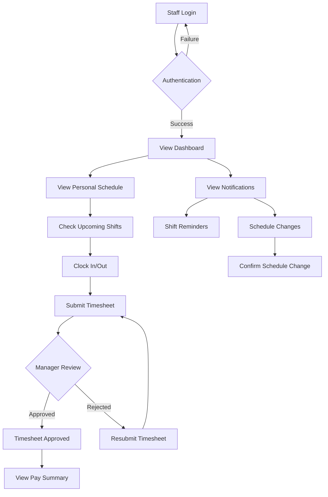

### Manager User Journey

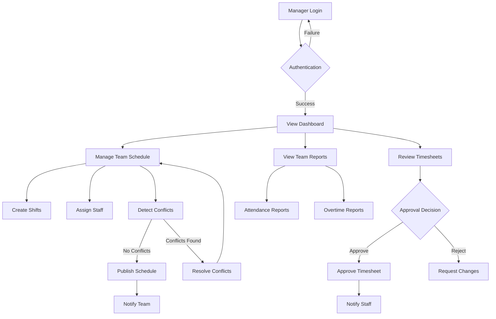

### Admin User Journey

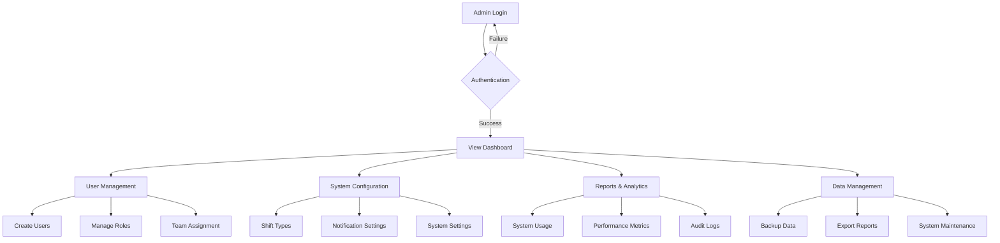

---

## Business Process Flows

### Shift Scheduling Process

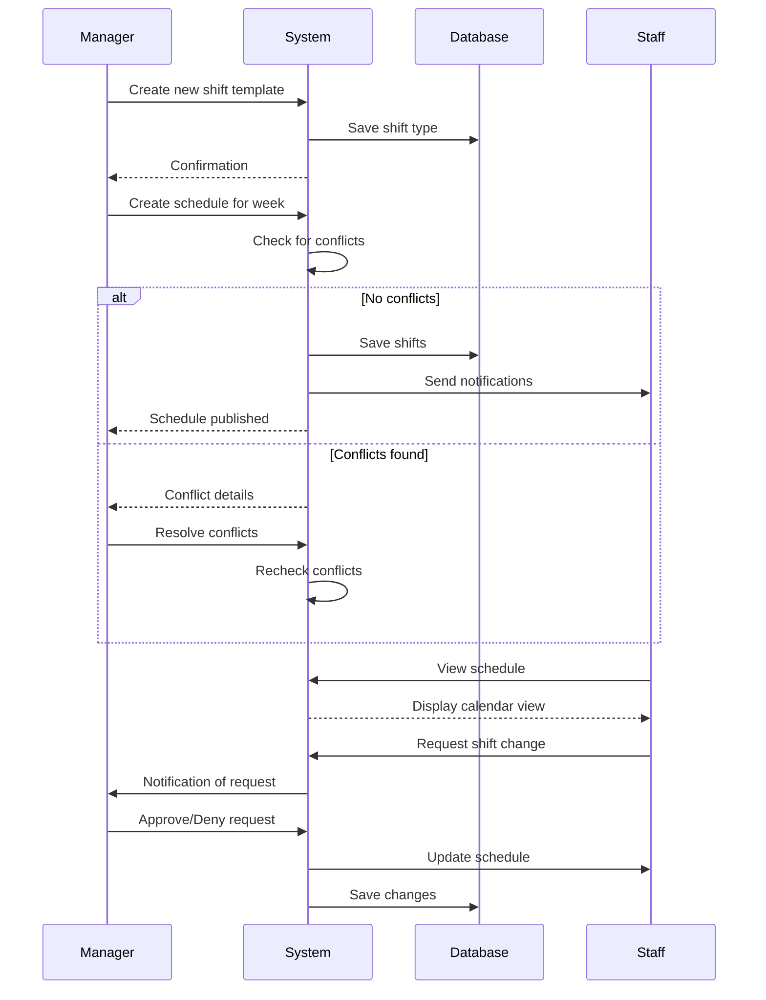

### Time Tracking and Approval Process

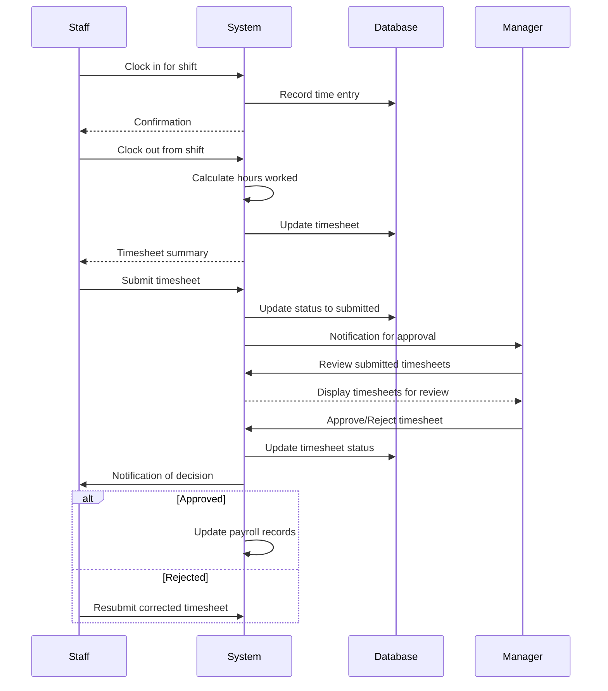

### User Registration and Onboarding Process

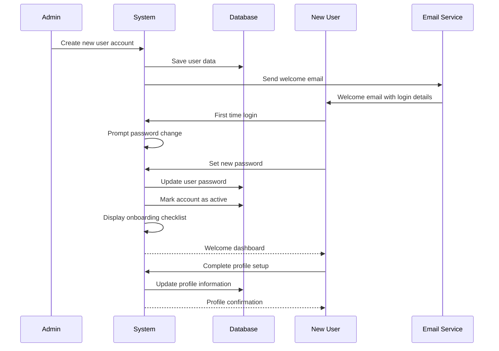

---

## Data Flow Diagrams

### System Data Flow Overview

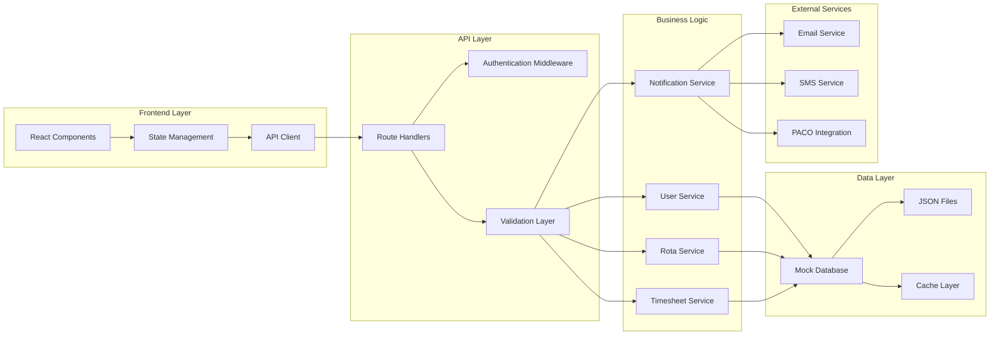

### Authentication Data Flow

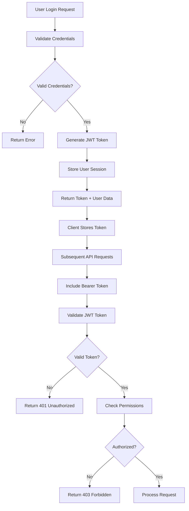

### Calendar Data Flow

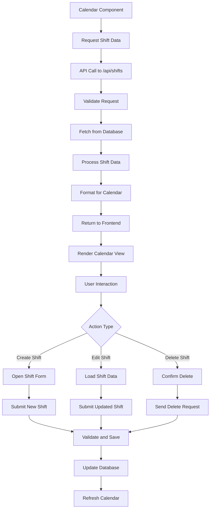

---

## System Integration Flows

### Notification System Integration

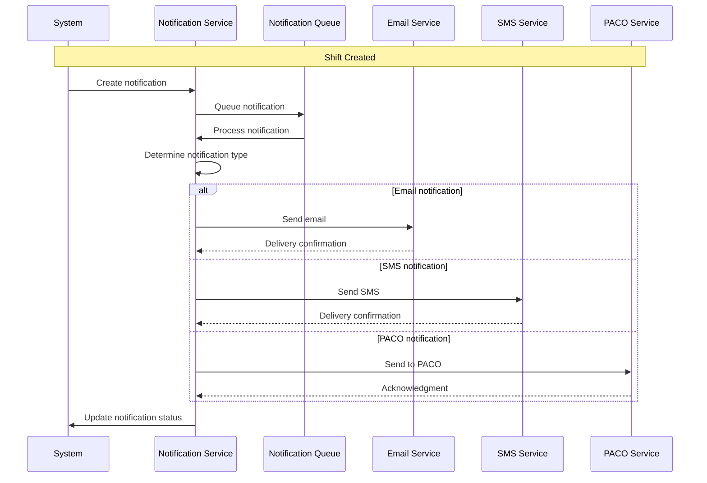

### External System Data Synchronization

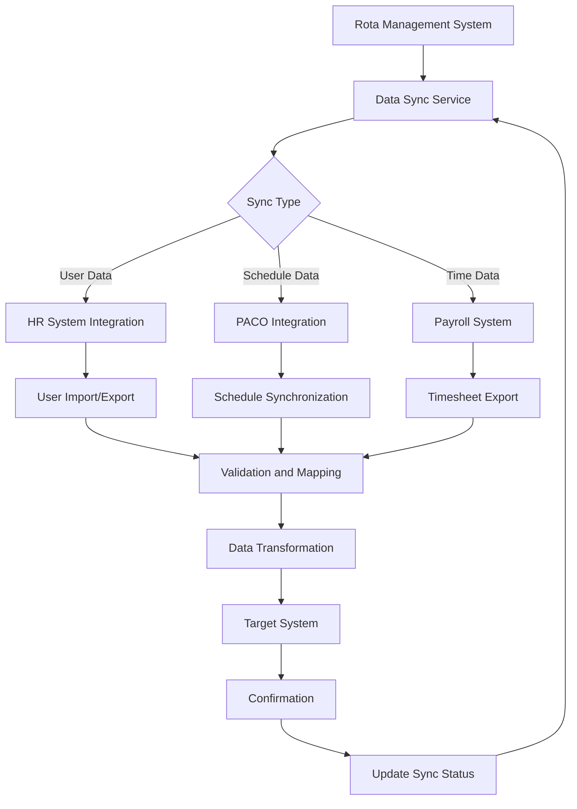

### Backup and Recovery Flow

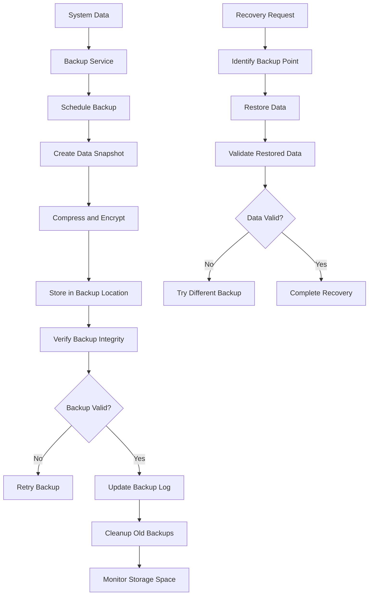

---

## Performance and Scaling Diagrams

### System Performance Architecture

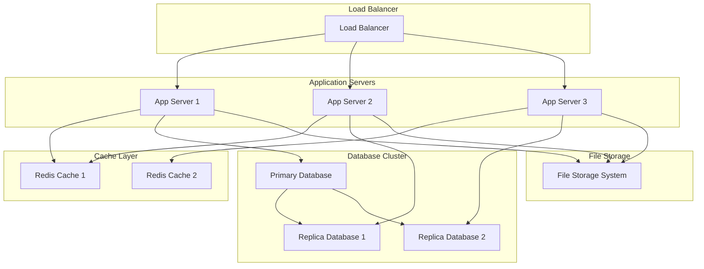

### Caching Strategy

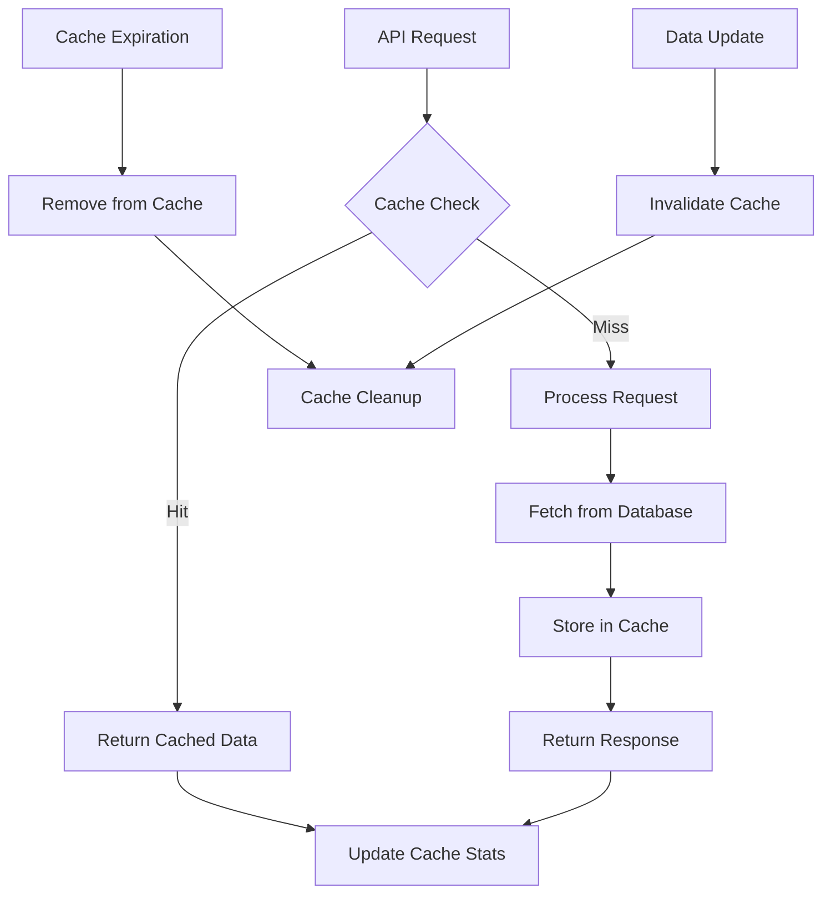

---

## Security Architecture

### Security Layers

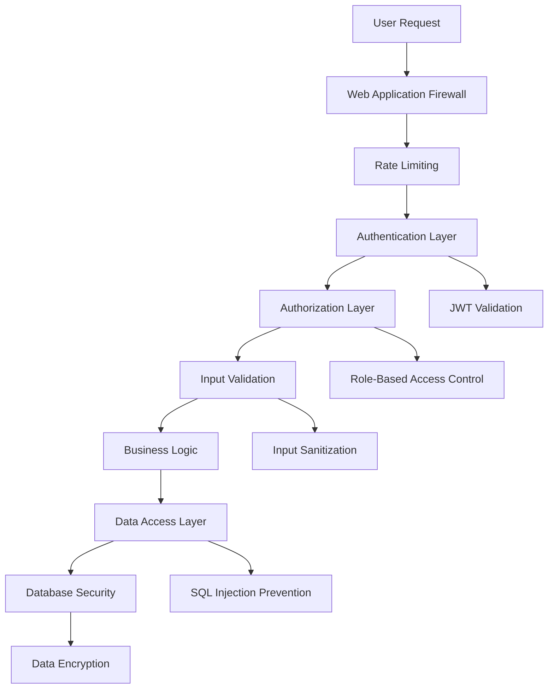

### Data Security Flow

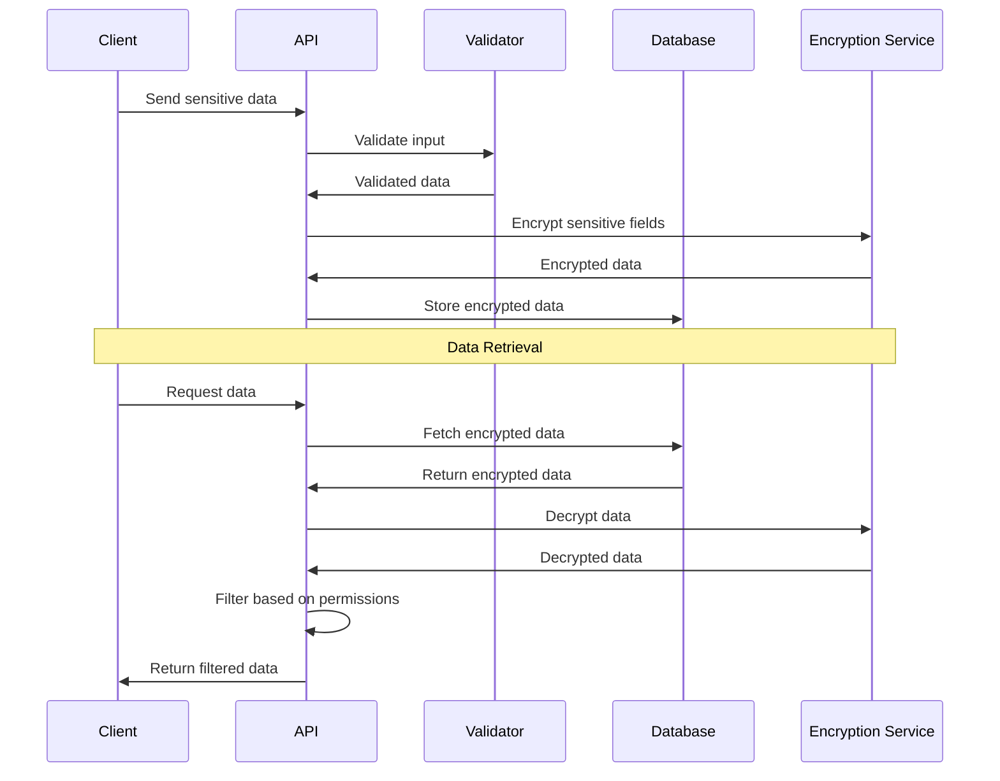

These flow diagrams provide comprehensive visual representations of the system's processes, data flows, and integrations. They complement the main architecture document by offering detailed insights into how different components interact and how business processes are executed within the system.